## 개요

HTB Academy Footprinting 모듈의 Hard Lab이다. 이번 실습의 목표는 노출된 네트워크 서비스를 꼼꼼히 열거해서 유효한 자격증명과 내부 데이터를 찾아내는 것이다.

- **서비스 열거**를 통해 공격 표면 파악
- **SNMP 정보 노출**에서 계정 단서 획득
- **IMAPS 메일함**에서 SSH 접근에 필요한 키 확보
- **MySQL 열거**를 통해 플래그 획득

사용한 주요 기법:

- Nmap TCP/UDP 포트 및 서비스 스캔
- OpenSSL `s_client`를 이용한 IMAPS 수동 확인
- SNMP community string 확인 및 `snmpwalk` 열거
- IMAPS 메일함 분석
- SSH private key 로그인
- MySQL 로컬 열거

---

## 1. 열거 (Enumeration)

### TCP 전체 포트 스캔

먼저 전체 TCP 포트를 대상으로 열린 포트를 확인했다.

```bash
# 공격자
┌──(netzy㉿kali)-[~/footprinting_hard/nmap]
└─$ sudo nmap -sS -Pn -n --open -p- -oA nmap_full_hard 10.129.87.32

PORT    STATE SERVICE
22/tcp  open  ssh
110/tcp open  pop3
143/tcp open  imap
993/tcp open  imaps
995/tcp open  pop3s
```

열린 포트: **22 (SSH)**, **110 (POP3)**, **143 (IMAP)**, **993 (IMAPS)**, **995 (POP3S)**

### TCP 서비스 버전 스캔

열린 포트를 대상으로 기본 스크립트와 서비스 버전 스캔을 실행했다.

```bash
# 공격자
┌──(netzy㉿kali)-[~/footprinting_hard/nmap]
└─$ sudo nmap -sV -sC -Pn -n --open -p22,110,143,993,995 -oA nmap_service_hard 10.129.87.32

PORT    STATE SERVICE  VERSION
22/tcp  open  ssh      OpenSSH 8.2p1 Ubuntu 4ubuntu0.3 (Ubuntu Linux; protocol 2.0)
| ssh-hostkey:
|   3072 3f:4c:8f:10:f1:ae:be:cd:31:24:7c:a1:4e:ab:84:6d (RSA)
|   256 7b:30:37:67:50:b9:ad:91:c0:8f:f7:02:78:3b:7c:02 (ECDSA)
|_  256 88:9e:0e:07:fe:ca:d0:5c:60:ab:cf:10:99:cd:6c:a7 (ED25519)
110/tcp open  pop3     Dovecot pop3d
|_pop3-capabilities: CAPA STLS AUTH-RESP-CODE UIDL TOP PIPELINING USER RESP-CODES SASL(PLAIN)
|_ssl-date: TLS randomness does not represent time
| ssl-cert: Subject: commonName=NIXHARD
| Subject Alternative Name: DNS:NIXHARD
| Not valid before: 2021-11-10T01:30:25
|_Not valid after:  2031-11-08T01:30:25
143/tcp open  imap     Dovecot imapd (Ubuntu)
|_imap-capabilities: AUTH=PLAINA0001 ENABLE have IDLE STARTTLS OK LITERAL+ more Pre-login SASL-IR ID capabilities listed LOGIN-REFERRALS IMAP4rev1 post-login
|_ssl-date: TLS randomness does not represent time
| ssl-cert: Subject: commonName=NIXHARD
| Subject Alternative Name: DNS:NIXHARD
| Not valid before: 2021-11-10T01:30:25
|_Not valid after:  2031-11-08T01:30:25
993/tcp open  ssl/imap Dovecot imapd (Ubuntu)
|_ssl-date: TLS randomness does not represent time
| ssl-cert: Subject: commonName=NIXHARD
| Subject Alternative Name: DNS:NIXHARD
| Not valid before: 2021-11-10T01:30:25
|_Not valid after:  2031-11-08T01:30:25
|_imap-capabilities: AUTH=PLAINA0001 IDLE ENABLE have OK LITERAL+ more Pre-login SASL-IR ID capabilities listed LOGIN-REFERRALS IMAP4rev1 post-login
995/tcp open  ssl/pop3 Dovecot pop3d
|_ssl-date: TLS randomness does not represent time
|_pop3-capabilities: CAPA TOP PIPELINING SASL(PLAIN) AUTH-RESP-CODE USER UIDL RESP-CODES
| ssl-cert: Subject: commonName=NIXHARD
| Subject Alternative Name: DNS:NIXHARD
| Not valid before: 2021-11-10T01:30:25
|_Not valid after:  2031-11-08T01:30:25
Service Info: OS: Linux; CPE: cpe:/o:linux:linux_kernel
```

인증서의 Common Name에서 호스트명이 **NIXHARD**임을 확인했다.

| Port | Service | Supported Capabilities / Commands                                                                       |
| ---: | ------- | ------------------------------------------------------------------------------------------------------- |
|  110 | POP3    | `USER`, `TOP`, `UIDL`, `RESP-CODES`, `AUTH-RESP-CODE`, `STLS`, `CAPA`, `SASL(PLAIN)`, `PIPELINING`      |
|  143 | IMAP    | `AUTH=PLAIN`, `SASL-IR`, `ENABLE`, `ID`, `LOGIN-REFERRALS`, `STARTTLS`, `IMAP4rev1`, `IDLE`, `LITERAL+` |
|  993 | IMAPS   | `AUTH=PLAIN`, `SASL-IR`, `ENABLE`, `ID`, `LOGIN-REFERRALS`, `IMAP4rev1`, `IDLE`, `LITERAL+`             |
|  995 | POP3S   | `USER`, `TOP`, `UIDL`, `RESP-CODES`, `AUTH-RESP-CODE`, `CAPA`, `SASL(PLAIN)`, `PIPELINING`              |

### UDP Top 100 스캔

메일 서비스 외에 UDP도 확인했다. 상위 100개 UDP 포트에서 SNMP가 열려 있었다.

```bash
# 공격자
┌──(netzy㉿kali)-[~/footprinting_hard/nmap]
└─$ sudo nmap -sU --top-ports 100 10.129.87.32 -oA udp_top100

PORT    STATE         SERVICE
68/udp  open|filtered dhcpc
161/udp open          snmp
```

### SSH 인증 방식 확인

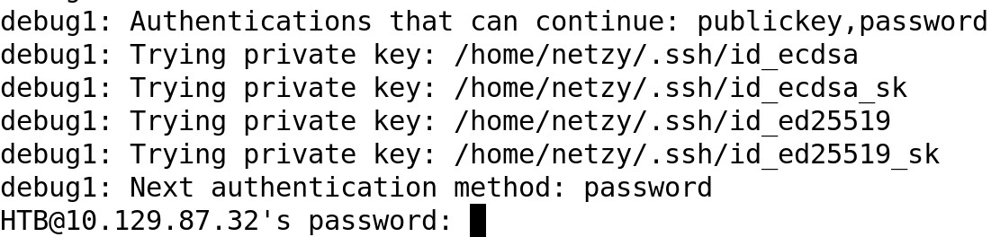

SSH는 password 인증과 public key 인증 방식이 모두 노출되어 있었다. 아직 유효한 자격증명이 없으므로, 이후 열거에서 계정명이나 키를 찾는 방향으로 진행했다.

---

## 2. SNMP 정보 수집

### 기본 community string 대입

먼저 `onesixtyone`으로 기본 community string을 대입했지만 바로 결과가 나오지는 않았다.

```bash
# 공격자
┌──(netzy㉿kali)-[~/footprinting_hard/nmap]
└─$ onesixtyone -c /usr/share/seclists/Discovery/SNMP/snmp.txt 10.129.87.32

# 결과 없음
```

### SNMP 스크립트 스캔

SNMP가 열려 있는지 다시 확인하기 위해 Nmap SNMP 스크립트를 실행했다.

```bash
# 공격자
┌──(netzy㉿kali)-[~/footprinting_hard/nmap]
└─$ sudo nmap -sU -p161 --script "snmp-*" 10.129.87.32

PORT    STATE SERVICE
161/udp open  snmp
| snmp-info:
|   enterprise: net-snmp
|   engineIDFormat: unknown
|   engineIDData: 5b99e75a10288b6100000000
|   snmpEngineBoots: 11
|_  snmpEngineTime: 2h33m28s
```

서비스 버전 스캔에서도 SNMP가 동작 중임을 확인했다.

```bash
# 공격자
┌──(netzy㉿kali)-[~/footprinting_hard/nmap]
└─$ sudo nmap -sU -p161 -sV 10.129.87.32

PORT    STATE SERVICE VERSION
161/udp open  snmp    net-snmp; net-snmp SNMPv3 server
```

### community string 확인

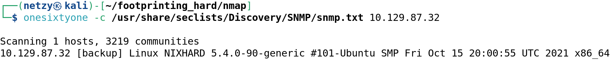

추가 확인 결과 community string은 **`backup`** 이었다.

### snmpwalk로 시스템 정보 열거

획득한 community string으로 `snmpwalk`를 실행했다.

```bash
# 공격자
┌──(netzy㉿kali)-[~/footprinting_hard/nmap]
└─$ snmpwalk -v2c -c backup 10.129.87.32

iso.3.6.1.2.1.1.1.0 = STRING: "Linux NIXHARD 5.4.0-90-generic #101-Ubuntu SMP Fri Oct 15 20:00:55 UTC 2021 x86_64"
iso.3.6.1.2.1.1.4.0 = STRING: "Admin <tech@inlanefreight.htb>"
iso.3.6.1.2.1.1.5.0 = STRING: "NIXHARD"
iso.3.6.1.2.1.1.6.0 = STRING: "Inlanefreight"
iso.3.6.1.2.1.25.1.4.0 = STRING: "BOOT_IMAGE=/vmlinuz-5.4.0-90-generic root=/dev/mapper/ubuntu--vg-ubuntu--lv ro ipv6.disable=1 maybe-ubiquity"
iso.3.6.1.2.1.25.1.7.1.2.1.2.6.66.65.67.75.85.80 = STRING: "/opt/tom-recovery.sh"
iso.3.6.1.2.1.25.1.7.1.2.1.3.6.66.65.67.75.85.80 = STRING: "tom NMds732Js2761"
iso.3.6.1.2.1.25.1.7.1.3.1.1.6.66.65.67.75.85.80 = STRING: "chpasswd: (user tom) pam_chauthtok() failed, error:"
iso.3.6.1.2.1.25.1.7.1.3.1.2.6.66.65.67.75.85.80 = STRING: "chpasswd: (user tom) pam_chauthtok() failed, error:
Authentication token manipulation error
chpasswd: (line 1, user tom) password not changed
Changing password for tom."
```

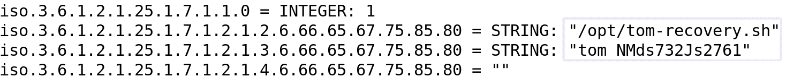

핵심 단서는 두 가지다.

- `/opt/tom-recovery.sh`
- `tom NMds732Js2761`

SNMP에서 백업 관련 스크립트와 `tom` 계정에 전달되는 문자열이 노출되었다. 이후 출력에는 `chpasswd` 실패 메시지도 남아 있었는데, 이 값이 `tom` 계정의 복구용 자격증명으로 사용되는 것으로 보였다.

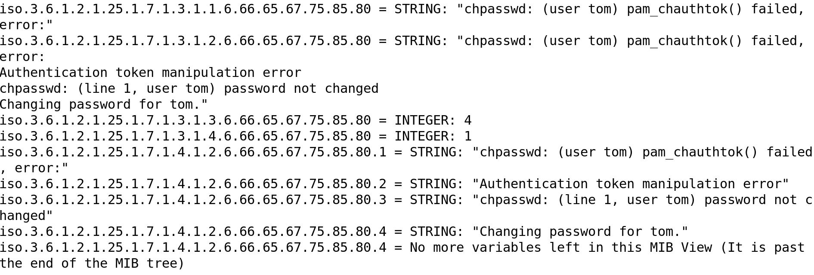

---

## 3. IMAPS 메일함 분석

### OpenSSL s_client로 IMAPS 연결

앞서 확인한 993번 포트에 `openssl s_client`로 직접 연결했다.

```bash
# 공격자
┌──(netzy㉿kali)-[~/footprinting_hard/imap]
└─$ openssl s_client -connect 10.129.87.32:imaps

read R BLOCK
* OK [CAPABILITY IMAP4rev1 SASL-IR LOGIN-REFERRALS ID ENABLE IDLE LITERAL+ AUTH=PLAIN] Dovecot (Ubuntu) ready.
```

### IMAP 명령어 및 메일함 확인

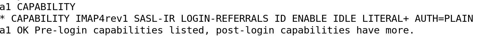

SNMP에서 얻은 `tom` 관련 값을 이용해 IMAPS 로그인을 시도했고, 메일함 목록을 확인했다.

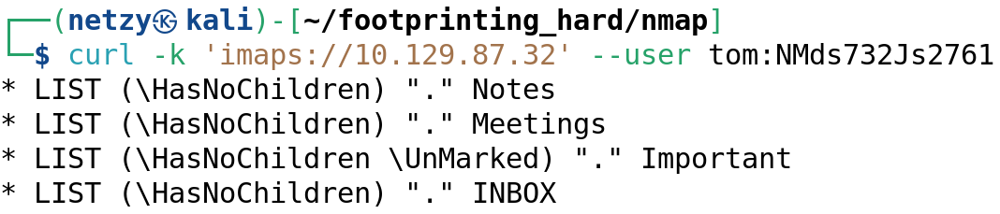

확인된 메일함:

- `Notes`
- `Meetings`
- `Important`
- `INBOX`

POP3S(995)도 함께 확인했지만, 핵심 단서는 IMAPS 메일함 쪽에서 더 명확하게 나왔다.

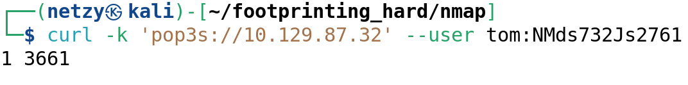

### Thunderbird로 메일 확인

메일 내용을 편하게 보기 위해 Thunderbird를 설치해 계정을 연결했다.

```bash
sudo apt install thunderbird
```

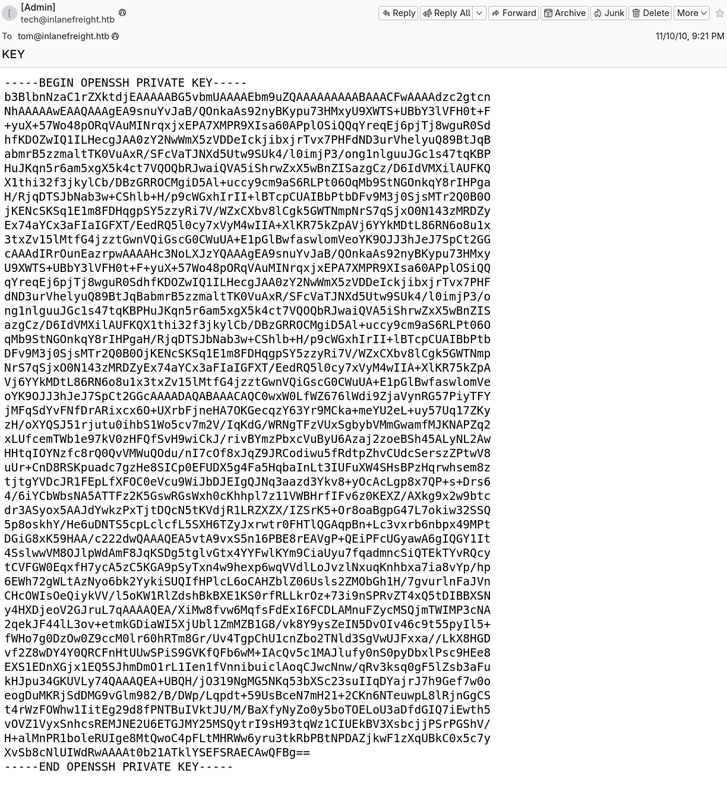

메일함에서 SSH 접근에 사용할 수 있는 키 관련 정보를 확인했다.

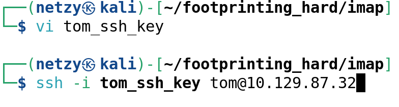

---

## 4. SSH 초기 접근

### private key 권한 조정

SSH private key는 파일 권한이 너무 열려 있으면 클라이언트가 사용을 거부한다. 따라서 키 파일 권한을 먼저 조정했다.


```bash
chmod 600 id_rsa
ssh -i id_rsa tom@10.129.87.32
```

### tom 계정 로그인

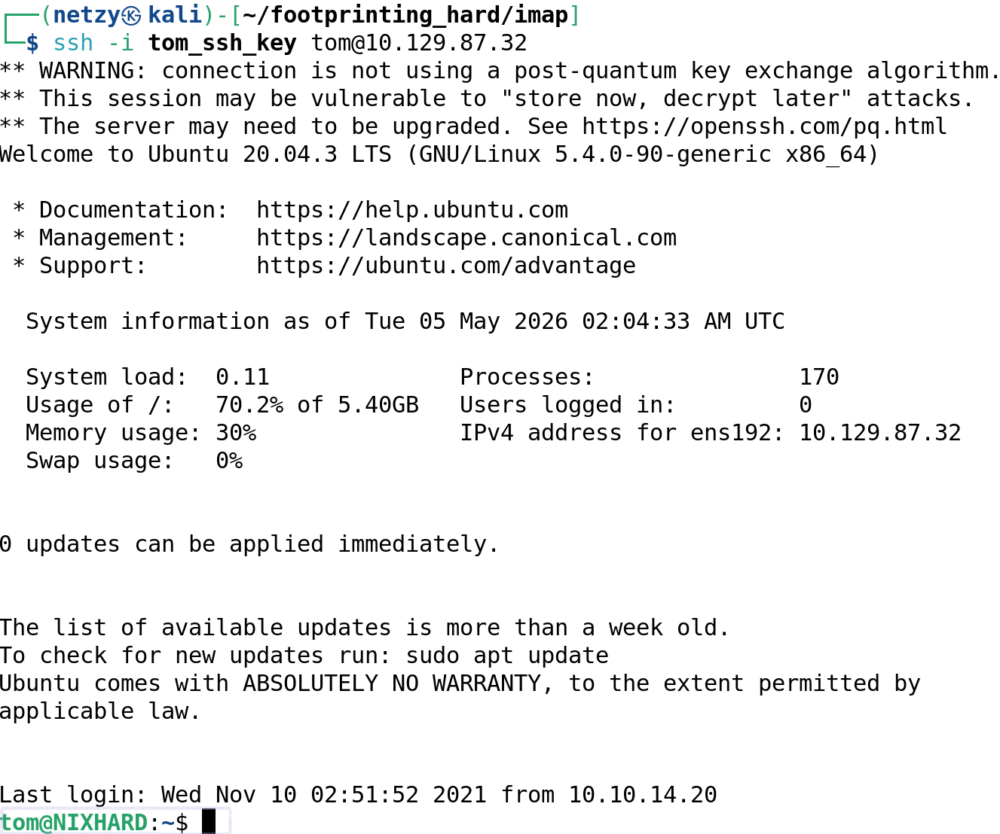

`tom` 계정으로 SSH 로그인에 성공했다. 이후 `id`로 그룹 정보를 확인하니 `mysql` 그룹에 포함되어 있었다.

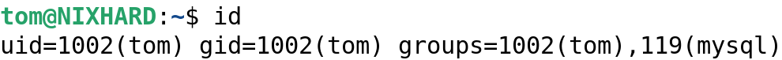

`mysql` 그룹 권한은 다음 열거 포인트가 된다.

---

## 5. 내부 열거와 MySQL 접근

### MySQL 서비스 확인

먼저 로컬에서 MySQL 서버가 동작 중인지 확인했다.

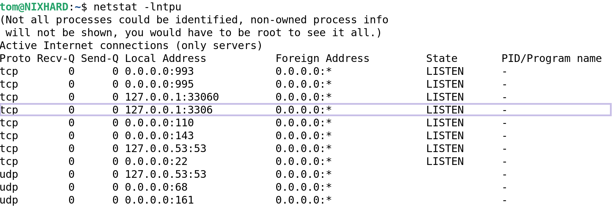

시스템 내 계정과 그룹도 함께 확인했다.

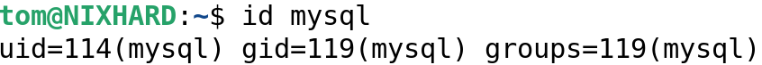

### 명령어 히스토리 확인

추가 단서를 얻기 위해 명령어 히스토리를 확인했다.

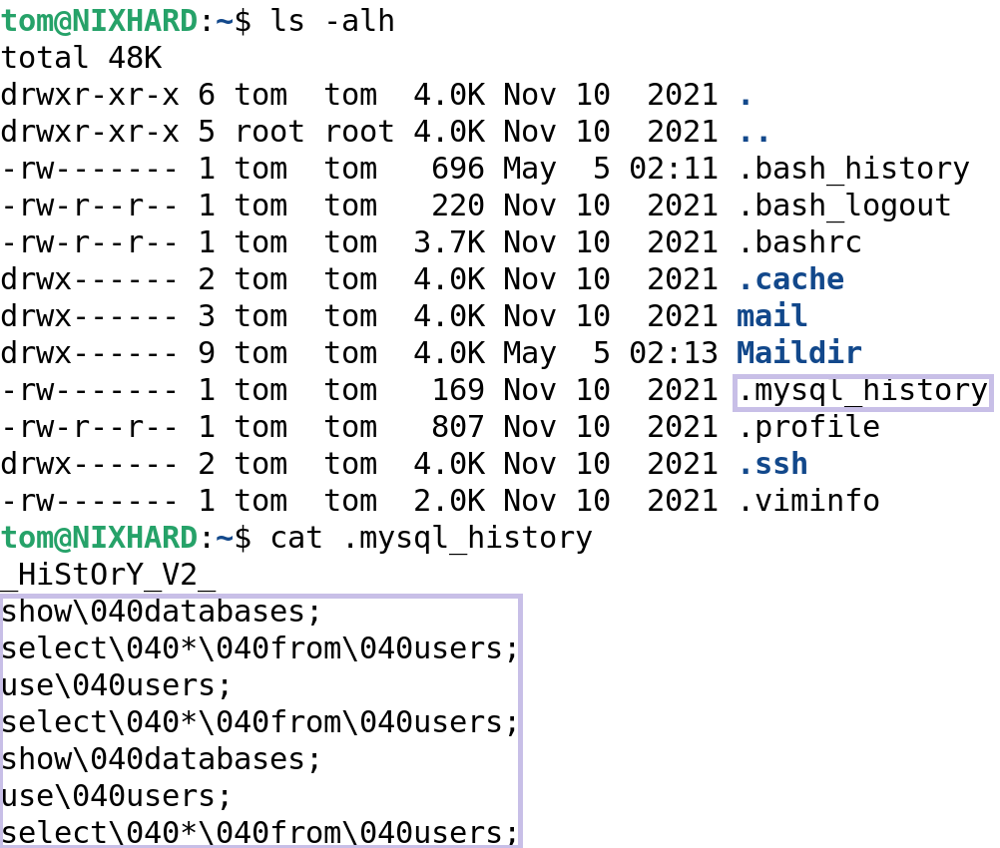

### 메일 저장소 크로스체크

IMAPS에서 이미 단서를 얻었지만, 혹시 Thunderbird에서 보지 못한 메일이 있는지 로컬 메일 저장소도 확인했다.

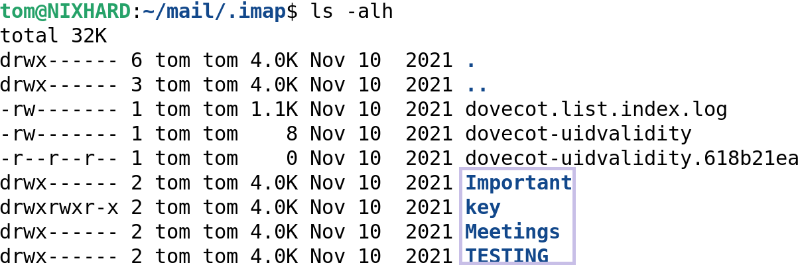

검색 결과 해당 위치에는 메타데이터가 저장되고, 실제 메일 데이터는 Maildir에 저장되는 구조였다.

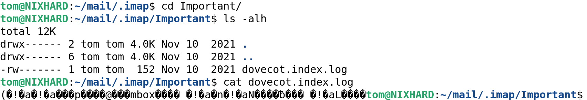

Maildir도 추가로 확인했다.

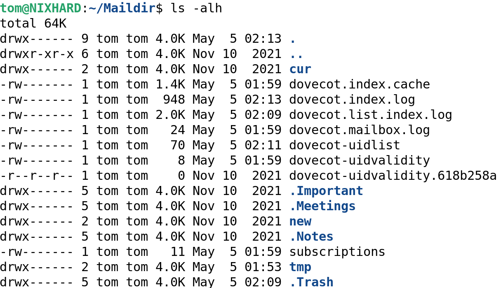

Thunderbird에서 확인하지 못한 새로운 결정적 단서는 없었다. 그래도 웹 UI/클라이언트에서 본 내용과 로컬 파일을 크로스체크했다는 점에서 의미가 있었다.

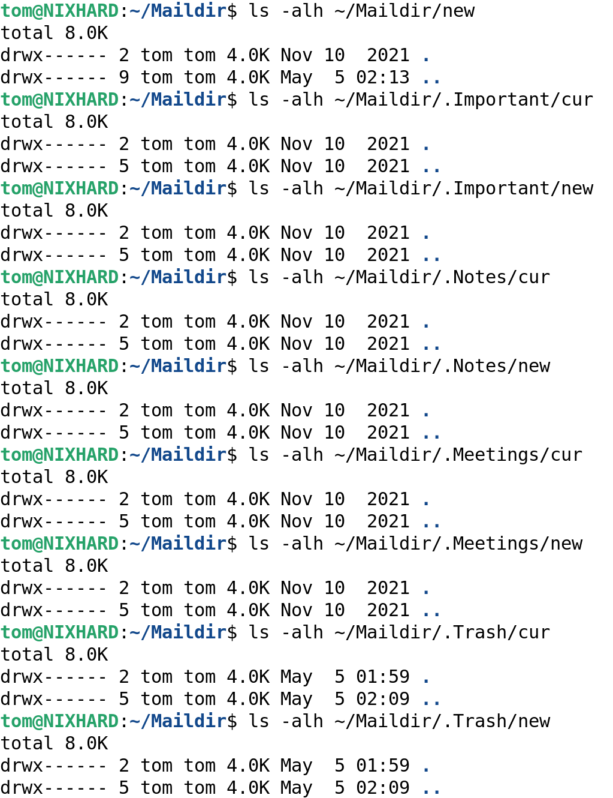

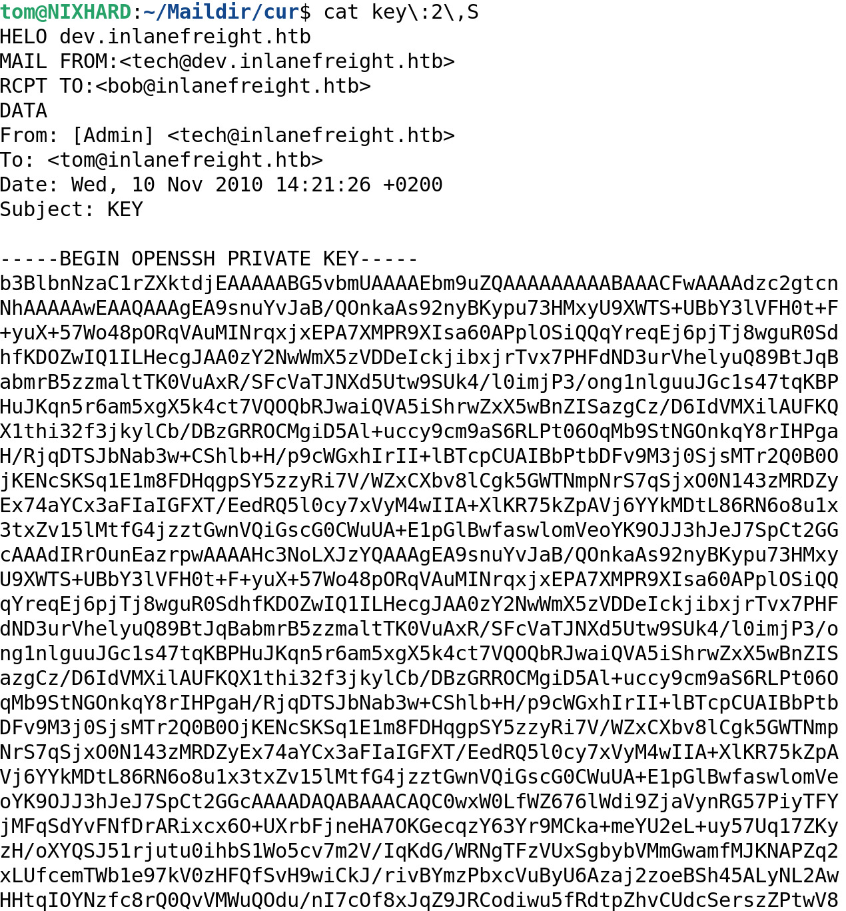

### sudo 권한 확인

바로 권한 상승할 수 있는 sudo 권한이 있는지도 확인했다.

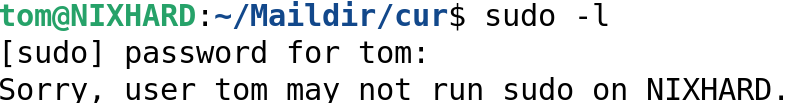

`sudo -l`에서는 유의미한 권한 상승 경로가 나오지 않았다. 따라서 MySQL 쪽을 계속 파기로 했다.

### MySQL 로그인

앞서 얻은 자격증명을 재사용해 MySQL 로그인을 시도했다.

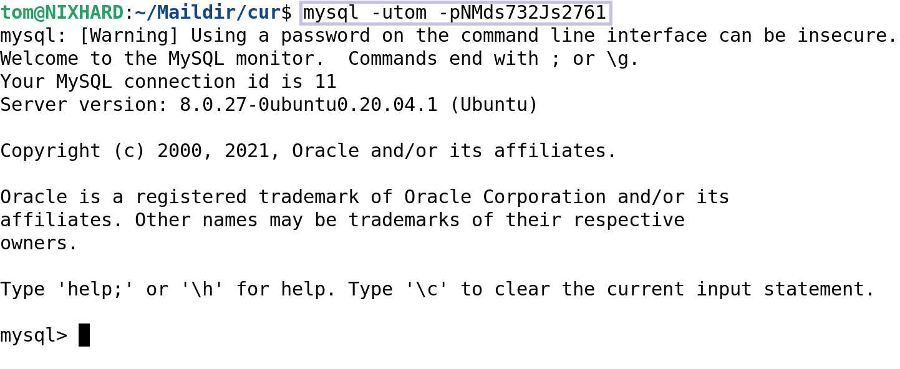

같은 자격증명으로 MySQL 로그인에 성공했다.

### 데이터베이스 열거

이제 데이터베이스와 테이블을 열거한다.

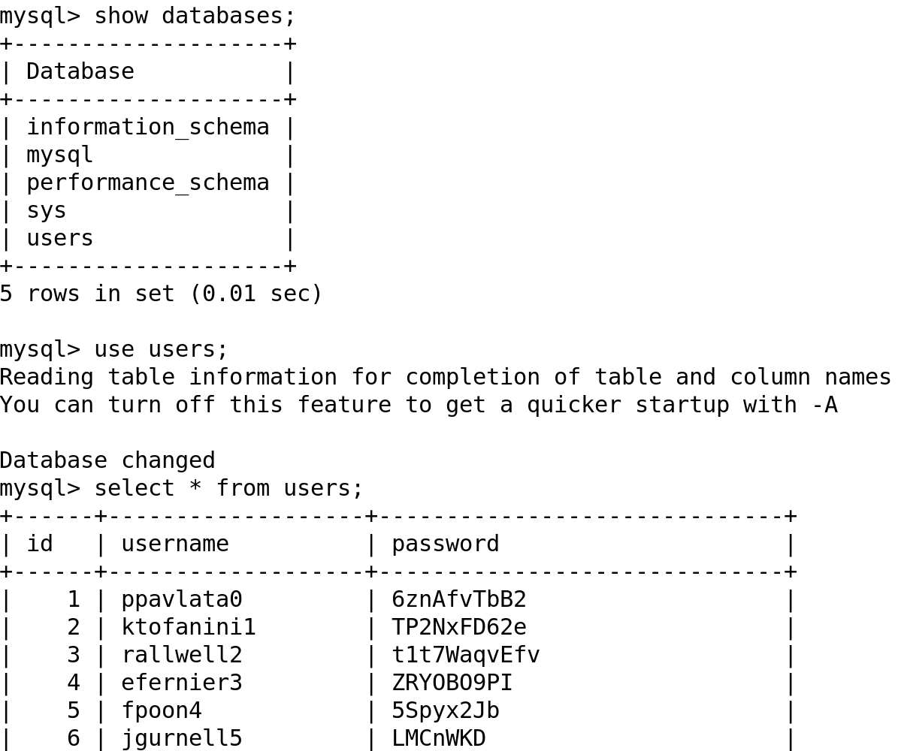

테이블 내부를 확인하면서 플래그 후보 값을 찾았다.

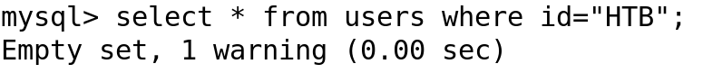

처음에는 다른 컬럼이 함정처럼 보였지만, 최종적으로 플래그 형식의 값을 확인할 수 있었다.

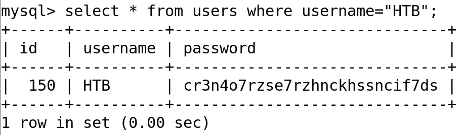

---

## 6. 공격 흐름 요약

```text
Nmap TCP 전체 포트 스캔
    ↓
Dovecot POP3/IMAP/IMAPS/POP3S 및 SSH 확인
    ↓
UDP 스캔으로 SNMP(161/udp) 발견
    ↓
SNMP community string backup 확인
    ↓
snmpwalk → /opt/tom-recovery.sh 및 tom 관련 자격증명 단서 획득
    ↓
IMAPS 로그인 → Notes / Meetings / Important / INBOX 확인
    ↓
메일함에서 SSH private key 관련 정보 확보
    ↓
키 권한 조정 후 tom 계정 SSH 로그인
    ↓
id 확인 → mysql 그룹 포함 확인
    ↓
MySQL 서비스 및 로컬 단서 열거
    ↓
동일 자격증명으로 MySQL 로그인
    ↓
DB 내부 데이터 열거 → 플래그 획득
```

---

## 7. 배운 점

- **SNMP community string 노출**은 시스템 정보 수준에서 끝나지 않는다. 이번처럼 실행 중인 스크립트, 계정명, 실패 로그, 복구용 문자열까지 이어질 수 있다.
- **메일 서비스 열거**는 자격증명을 얻은 뒤 반드시 확인해야 한다. IMAPS/POP3S는 암호화되어 있어도, 계정이 뚫리면 메일함 안의 키나 운영 단서가 그대로 노출된다.
- **SSH private key 권한**은 기본기지만 실전에서 자주 발목을 잡는다. `chmod 600`을 먼저 확인하면 불필요한 삽질을 줄일 수 있다.
- **그룹 정보 확인**은 초기 접근 이후의 핵심 루틴이다. `mysql` 그룹처럼 특정 서비스 접근으로 이어지는 권한은 바로 다음 공격 경로가 될 수 있다.
- **자격증명 재사용**은 여전히 강력한 취약점이다. SNMP에서 얻은 단서가 IMAPS, SSH, MySQL로 이어지면서 전체 풀이 흐름이 완성됐다.
