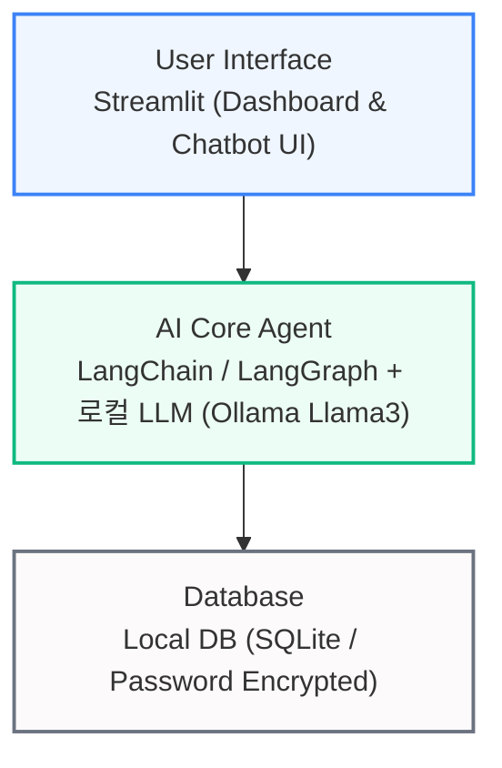
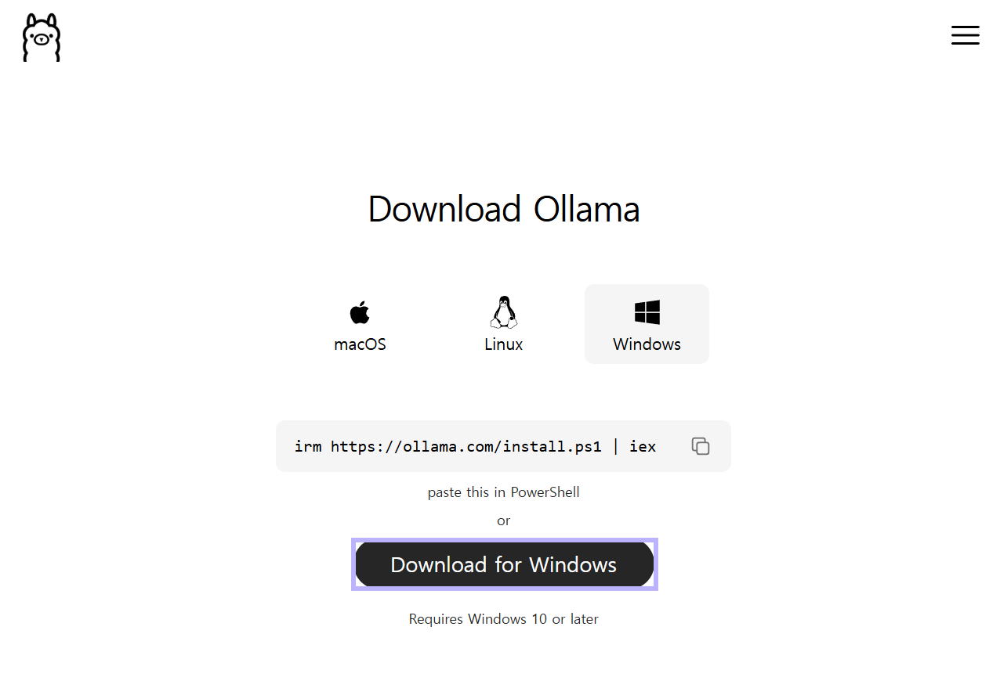
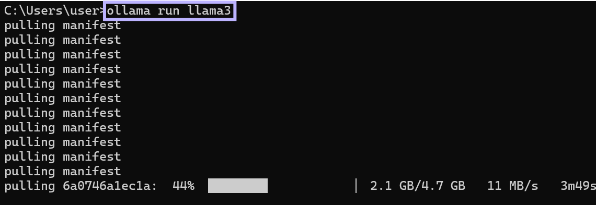
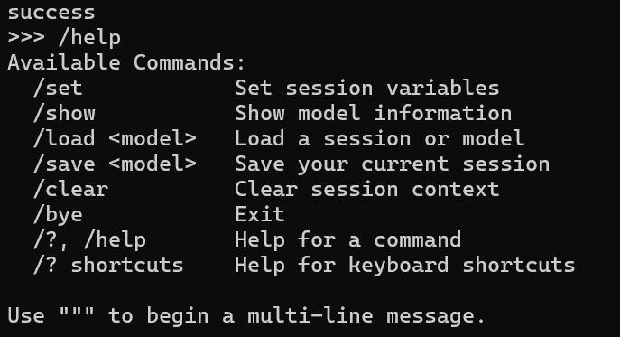
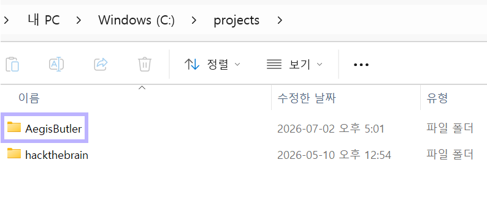
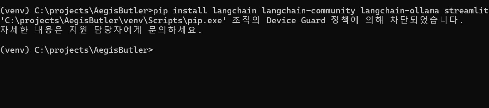
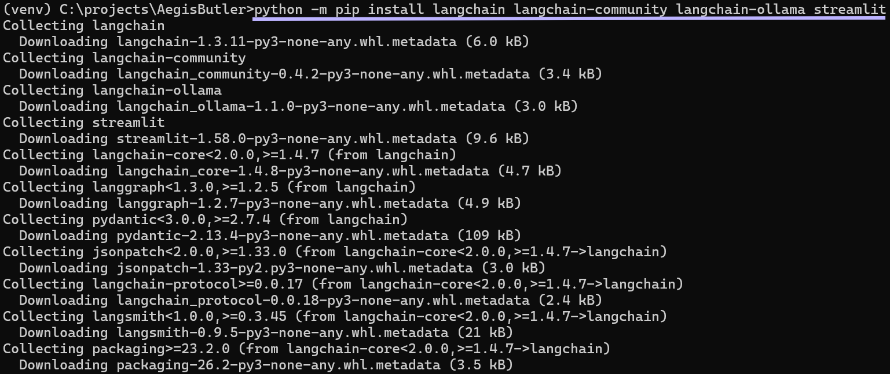
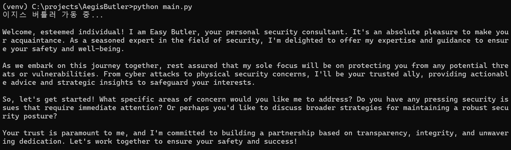

## 1. 프로젝트 개요

| 항목 | 상세 내용 |
| :---- | :------ |
| **프로젝트명** | **AegisButler** (신의 방패 `Aegis` + 집사 `Butler`) |
| **개발 목적** | 전체적인 정기 구독 서비스 관리를 위한 **중앙 집중형 대시보드** 및 LangChain AI Agent 기반의 대화형 **챗봇** 서비스 구현 |
| **타겟 사용자** | 개발자 본인 전용 |

## 2. 기획 배경

| 기획 축 | 현실적 문제 | 프로젝트를 통한 목표 |
| :--- | :--- | :--- |
| **구독 서비스 파편화** | OTT, 음악 스트리밍, AI 등 정기 결제 플랫폼의 확장으로 인해 지출 현황, 다음 결제일, 서비스별 계정 자산 정보를 한눈에 파악하기 어렵고, 하나하나 결제 취소 URL 찾기 귀찮음 | **중앙 집중형 대시보드**를 구축하여 고정 지출을 가시화하고, 결제 취소의 복잡성을 해소하여 개인 자산 관리 편의성 극대화 |
| **AI 보안 역량 강화** | 개인 비서를 활용하여 최신 AI Agent 아키텍처 도입 시 프롬프트 인젝션, 권한 남용 등의 독특한 AI 취약점 존재 가능 | 발생 가능한 공격 표면을 정의 |

## 3. 요구사항 정의서

### 시스템 요구사항
OS: Windows 11
인프라: 로컬 개발 환경 (외부 클라우드 의존성 최소화)  
AI 백엔드: 로컬 컴퓨터에서 구동되는 경량 LLM (Ollama - Llama 3 8B) 및 LangChain 프레임워크 기반 에이전트

### 기능적 요구사항
| 기능 요구사항 명칭 | 상세 요구사항 내용 |
| :--- | :--- |
| **로컬 데이터베이스 구축** | 구독 서비스 목록, 카테고리, 결제 금액, 결제일, 계정 정보(ID/PW), 각 서비스의 환불/해지 링크 정보를 관리하는 데이터 모델 설계 |
| **대화형 AI Agent** | 사용자의 자연어 질문을 해석하여 로컬 DB를 조회하고 답변하는 정교한 엔진 탑재 |
| **중앙 집중형 대시보드** | 이번 달 총 지출, 서비스별 유지 상태, 다가오는 결제일 등을 시각화 차트로 한눈에 볼 수 있는 UI 제공 |
| **스케줄러 기반 자동화 알림** | 매일 아침 결제일이 임박한(예: 3일 전) 구독 서비스를 탐지하여 사용자에게 브리핑하는 백그라운드 자동화 루틴 실행 |

### 전체 시스템 아키텍처 초안 (Architecture)



## 4. 개발 환경 구축 및 로컬 LLM 연동
### 4-1. Ollama 설치 및 Llama 3 모델 다운로드
외부 클라우드 API를 사용할 때 발생할 수 있는 민감 정보의 사외 유출 리스크를 원천 차단하기 위해, 로컬에서 독립적으로 추론이 가능한 **Ollama** 인프라를 구축
| 인프라 구축 단계 | 수행 가이드 및 주요 확인 사항 |
| :--- | :--- |
| **1) Ollama 엔진 다운로드** | [Ollama 공식 홈페이지](https://ollama.com/download)에 접속하여 Windows용 인스톨러 설치 |
| **2) Llama 3 (8B) 모델 가동** | 터미널(CMD/PowerShell)에서 `ollama run llama3` 명령어를 실행하여 메타의 경량 LLM 자산 확보 |
| **3) 하드웨어 요구사항 검토** | 로컬 컴퓨터의 그래픽카드 메모리(VRAM)가 **8GB 이상**일 경우 안정적이고 쾌적한 추론 환경 보장 |


Download for Windows 클릭

cmd 창에서 `ollama run llama3` 실행하여 llm 다운로드  
  
설치 후 `/exit`로 대화창에서 탈출

---

### 4-2. 파이썬 가상환경 구성 및 보안 우회 트러블슈팅
프로젝트의 독립된 패키지 관리를 위해 `C:\projects\AegisButler` 경로에 가상환경(`venv`) 생성 및 라이브러리 설치 진행

C:\projects\AegisButler 프로젝트 폴더 생성


```bash
# 가상환경 생성 및 활성화
cd C:\projects\AegisButler
python -m venv venv
.\venv\Scripts\activate
```


```
# 초기 설치 시도
pip install langchain langchain-community langchain-ollama streamlit
```


**차단 발생**  

에러 원인 : 윈도우 11의 애플리케이션 제어 정책인 Device Guard(WDAC)가 가상환경 내부 경로의 pip.exe 실행 파일을 신뢰할 수 없는 바이너리로 규정하여 실행 권한을 강제 차단  

**python -m pip 형태로 우회하여 pip 모듈 형태로 실행**

```
python -m pip install langchain langchain-community langchain-ollama streamlit
```




설치 성공  

## 5. 첫 가동 테스트
C:\projects\AegisButler 하위에 main.py 생성

```
# main.py
from langchain_ollama import OllamaLLM

# 1. 로컬에 구동 중인 Llama3 모델 백엔드 로드
llm = OllamaLLM(model="llama3")

# 2. 에이전트 아이덴티티 부여 및 프롬프트 주입
question = "너는 지금부터 개인 보안 비서 '이지스 버틀러'야. 사용자에게 첫인사를 건네줘."

print("이지스 버틀러 가동 중...\n")
response = llm.invoke(question)
print(response)
```


### 첫 테스트 결과
로컬 LLM 자산이 사용자의 시스템 지침을 정확히 인지하여 정해진 컨텍스트 안에서 무결한 첫 응답을 정상 출력하는 것을 확인

## 6. 아키텍처 빌드 프로세스 및 향후 계획

AegisButler은 아래의 개발 단계를 거쳐 순차적으로 고도화할 예정

| 개발 단계 | 주요 구현 테스크 |
| :--- | :--- |
| **Phase 1 (완료)** | 로컬 LLM 환경 세팅 및 가상환경 구축 |
| **Phase 2 (예정)** | 로컬 SQLite DB 구축 및 스키마 설계 |
| **Phase 3 (예정)** | LangChain SQL Agent 인프라 연동 |
| **Phase 4 (예정)** | Streamlit 대시보드 UI 통합 |